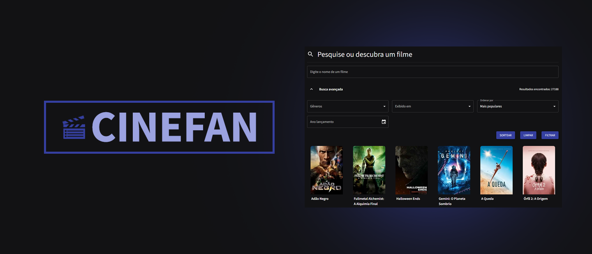

<h1 align="center">
    
</h1>

## 🎬 Sobre o projeto

CINEFAN é um site que apresenta um repositório de informações de filmes. Você pode registrar seus filmes favoritos, filmes que já assistiu e descobrir inúmeros outros através do filtro presente no site.

Os usuários terão acesso a aplicação mobile, onde poderão:

- Usuário sem cadastro:
  - Ver os filmes mais populares, filmes que estão no cinema e os próximos lançamentos
  - Ver os detalhes dos filmes, como gênero, duração, sinopse, elenco e onde ele está disponível
  - Pesquisar por filmes utilizando a busca avançada
  - Sortear um filme para ser assistido
  - Se cadastrar na plataforma
- Usuário cadastrado, além das funcionalidades para os usuários sem cadastro, também é possível:
  - Salvar filmes como favoritos
  - Salvar filmes para serem assistidos
  - Salvar filmes já assistidos
  - Criar e participar de grupos
    - E ao entrar em um grupo você pode criar ou participar de sessões

Este repositório é o front-end do projeto, acesse, também, o [back-end](https://github.com/ViniciusAlexsander/backend-tcc/).

## 💻 Tecnologias

As seguintes ferramentas foram usadas na construção do projeto:

- [Node.js][nodejs]
- [React][reactjs]
- [Next.JS][nextjs]
- [TypeScript][typescript]

## 🎨 Layout

Foram feitos wireframes da aplicação antes do desenvolvimento, para termos uma visão geral das funcionalidades que queríamos e onde deveriam ficar. Esses wireframes podem ser acessados através do link a seguir: [Wireframes](https://wireframe.cc/pro/pp/635115ec2575591).


## 📁 Estrutura de pastas

A pasta “src” (acrônimo para source), contém as pastas mais importantes do projeto com a maior parte dos arquivos referentes ao site, criados e escritos pelos desenvolvedores.

- **Context**: aqui mantivemos os arquivos que utilizam do context api, um gerenciador de estado global.

- **Pages**: Nesta página estão os códigos escritos em React para as paginas

- **Services**: Para a requisição de serviços externos, como o back-end, a pasta “services” contém arquivos no formato TS para a realização dessa comunicação, seguindo o padrão REST.

- **Components**: são trechos de código que se repetem, onde nenhuma (ou pouca informação) é diferente, e podem ser utilizados em mais de uma página.

- **Models**: Nesta pasta estão os models dos objetos que serão retornados das requisições aos serviços externos.

- **Utils**: Responsável por manter códigos com funções auxiliares

- **Styles**: Responsável por manter arquivos de estilo e o arquivo de configuração do tema da aplicação.

## 🚀 Como executar o projeto

💡 É necessário que o [back-end](https://github.com/ViniciusAlexsander/backend-tcc) esteja sendo executado para funcionar.

### 📋 Pré-requisitos

Antes de começar, você vai precisar ter instalado em sua máquina as seguintes ferramentas:
[Git](https://git-scm.com), [Node.js][nodejs].
Além disto é bom ter um editor para trabalhar com o código como [VSCode][vscode]

### 🧭 Rodando o front-end (aplicação web)

```bash
# Clone este repositório
$ git clone https://github.com/ViniciusAlexsander/frontend-tcc

# Acesse a pasta do projeto no seu terminal/cmd
$ cd frontend-tcc

# Instale as dependências
$ npm install

# Faça uma cópia do arquivo .env.example e altere para .env.local e substitua os valores das variáveis de ambiente
NEXT_PUBLIC_MOVIE_DB_API_KEY= (sua chave de api)
NEXT_PUBLIC_URL_BFF= (url do seu backend)
NEXT_PUBLIC_URL_MOVIES_API=https://api.themoviedb.org/3


# Execute a aplicação em modo de desenvolvimento
$ npm run dev

# A aplicação será aberta na porta:3000 - acesse http://localhost:3000
```

Feito com 💜 por [Nayla Gomes 👩‍💻](https://www.linkedin.com/in/naygo/) e [Vinicius Marinho 👨‍💻](https://www.linkedin.com/in/vinicius-alexsander-lima-marinho/).

[nodejs]: https://nodejs.org/
[typescript]: https://www.typescriptlang.org/
[reactjs]: https://reactjs.org
[nextjs]: https://nextjs.org/
[yarn]: https://yarnpkg.com/
[vscode]: https://code.visualstudio.com/
[vceditconfig]: https://marketplace.visualstudio.com/items?itemName=EditorConfig.EditorConfig
[license]: https://opensource.org/licenses/MIT
